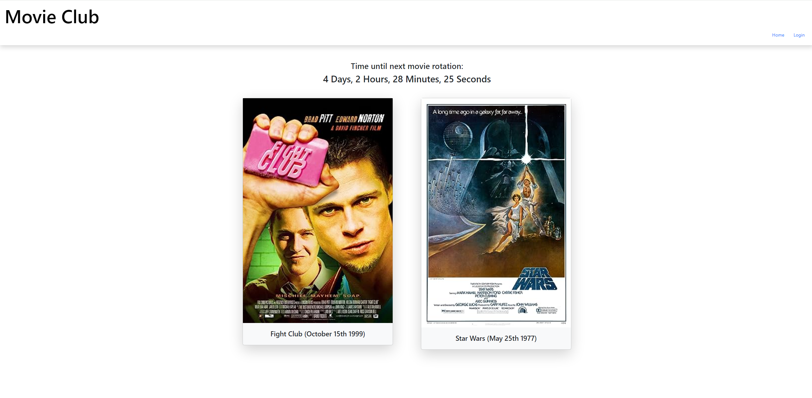

# Group Project 2 - Movie-Club

        
## Description
            
This project is a full-stack community-focused movie reviewing application which follows the MVC (Model–view–controller) paradigm in its architectural structure. It uses Handlebars.js as the templating language, Sequelize as the ORM, and the express-session npm package for authentication.

This application was built so that people could review and discuss films in a community environment similar to a recurring 'book club'.

It was developed by Isaac Fallon, Timothy Wong, Soni Poudel and James Cameron-Taylor.

### Screenshots of the application's UI (User Interface):

- The application's home page showcasing this week's two films on rotation:

            
## Table of Contents
            
- [Installation](#installation)
- [Usage](#usage)
- [License](#license)
- [Contributing](#contributing)
- [Tests](#tests)
- [Questions](#questions)
            
## Installation

To install this application, you'll need to clone the repository to your local machine. [Refer to this guide from GitHub if you need help.](https://docs.github.com/en/repositories/creating-and-managing-repositories/cloning-a-repository/)

Once cloned, you will need to navigate to the project's folder in your terminal and run the following command to install the necessary dependencies: `npm install`.

Next, you will need PostgreSQL installed on your computer to initialise the database. [Visit PostgreSQL's website for links to download and installation instructions.](https://www.postgresql.org/)

            
## Usage

To use the deployed application, visit a link to the website deployed on Render here:

https://movie-club-project-2.onrender.com/
            
## License
            
MIT License

Copyright (c) 2024 Isaac Fallon, Timothy Wong, Soni Poudel and James Cameron-Taylor.
            
Permission is hereby granted, free of charge, to any person obtaining a copy
of this software and associated documentation files (the "Software"), to deal
in the Software without restriction, including without limitation the rights
to use, copy, modify, merge, publish, distribute, sublicense, and/or sell
copies of the Software, and to permit persons to whom the Software is
furnished to do so, subject to the following conditions:
            
The above copyright notice and this permission notice shall be included in all
copies or substantial portions of the Software.
            
THE SOFTWARE IS PROVIDED "AS IS", WITHOUT WARRANTY OF ANY KIND, EXPRESS OR
IMPLIED, INCLUDING BUT NOT LIMITED TO THE WARRANTIES OF MERCHANTABILITY,
FITNESS FOR A PARTICULAR PURPOSE AND NONINFRINGEMENT. IN NO EVENT SHALL THE
AUTHORS OR COPYRIGHT HOLDERS BE LIABLE FOR ANY CLAIM, DAMAGES OR OTHER
LIABILITY, WHETHER IN AN ACTION OF CONTRACT, TORT OR OTHERWISE, ARISING FROM,
OUT OF OR IN CONNECTION WITH THE SOFTWARE OR THE USE OR OTHER DEALINGS IN THE
SOFTWARE.
            
## Contributing

This application was developed in collaboration by Isaac Fallon, Timothy Wong, Soni Poudel and James Cameron-Taylor.
            
## Tests

N/A
     
## Questions
            
If you have any questions, please reach out at either of the following:
            
### GitHub profile:
- https://github.com/isaacfallon

### Email:
- isaac.fallon@gmail.com